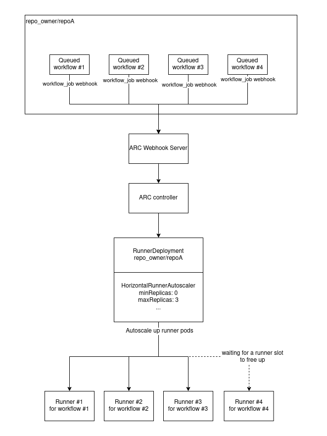

# Github Action Runner Controller on Kubernetes

## How does it work

The goal of the Action Runner Controller is to use self-hosted runners deployed on Kubernetes to handle Github action's workflow that can be scaled up/down on demand.

### Triggering webhook

Webhook can be sent when a workflow is triggered either at a repository level of using a Github App. Using a Github App is the prefered method as it allows higher rate limit quota and it can trigger webhooks for all repos under an organization or owner.

A webhook will be sent to the `webhook server` when a workflow is queued, completed or failed. This will either trigger a scale up or scale down of the corresponding runner.

### Action Runner Controller

The Action Runner Controller is made up of a couple deployment. The `controller` and the `webhook server`. The `webhook server` receives webhooks from Github when a new workflow setup to run on self-hosted runners starts up and let the `controller` knows about it.

Based on the `Runners` defined in Kubernetes, the `controller` then decides if, where and how many runners should be started on Kubernetes to handle those workflows.

### RunnerDeployment and HorizontalRunnerAutoscaler CRDs

The runners to be deployed by the `controller` are defined using CRDs. In those CRDs you would configure what repo/organization has access to this group of runner, how many concurrent runners max can be deployed and on what Kubernetes node they should be deployed. Other options are available like what resource quota does the runners have access to, what base image to use, what additional sidecar containers should be deployed, etc.

### Scale up or down

When a workflow on Github gets created in the queued state, it sends a webhook to the `webhook server` which trickles down to the `controller` which increases the `desired replica` of the corresponding `HorizontalRunnerAutoscaler` by 1.

Once the workflow completes, another webhook is sent to the `webhook server` then to the `controller` which decreases the `desired replica` by 1.

If there are more workflows than available runners (i.e. number workflows > runner maxReplica), the additional workflows will stay in the queued state until one of the workflow assigned to a runner completes. At this point the runner will be terminated and a new one created to handle the pending workflow.

:warning: Runner requests sent to the `controller` will eventually expire and workflow waiting for an available runner will eventually timeout. The expiration time of runners requests can be set in the `HorizontalRunnerAutoscaler` CRD using the `spec.scaleUpTriggers[].duration` setting.
